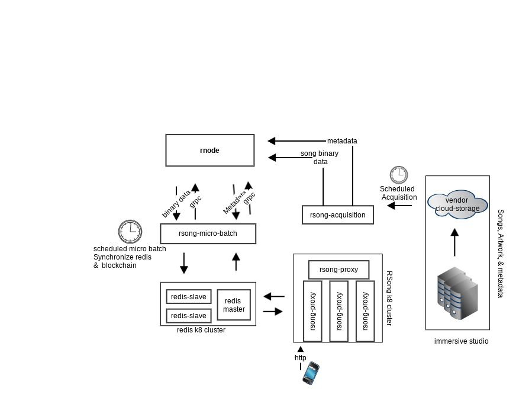

# RSong Proxy

A REST layer to proxy RSong mobile device requests RSongs Rholang contracts

## Getting Started

These instructions will get you a copy of the project up and running on your local machine for development and testing purposes. See deployment for notes on how to deploy the project on a live system

### Prerequisites

#### Installs

- [sbt](https://www.scala-sbt.org/)
- [JDK8](http://www.oracle.com/technetwork/pt/java/javase/downloads/jdk8-downloads-2133151.html?printOnly=1)
- [docker](https://www.docker.com/)

#### clone and build the project

```
git clone git@github.com:rchain/rsong-proxy.git
cd rsong-proxy
sbt compile
```

## Running the project locally

To run the project locally:
- set the environment variables
- run the docker

Alternatively you may build and run the project from source code.

### Environment variables

To run the project locally, configure your environment variables:

```
export HTTP_PORT=9000
export AUTH_NAME=secrete-user-name
export AUTH_PASSWORD=serete-password
export API_VERSION=v1
export GRPC_SERVER=localhost
export HOST_URL=http://localhost:9000
```
You may consider using [direnv](https://direnv.net/) to manage projects environment variables

### Run the docker image
The build process pushes the docker image to docker hub. To run the image:

```
./docker-run.sh
```

### Running the Source code

```
sbt clean compile run
## to create a local dokcer image
sbt clean compile docker:stage docker:publishLocal
docker images | grep 'rsong-proxy'
```

### Running tests:
tests are:
- unit tests
- integration tests

#### Unit tests
```
sbt clean test
```

## url Inventory
```
host='localhost:9000'

## create a new user 
curl -X POST $host/v1/user/<user_id>

## retrieve  user  object
curl  $host/v1/user/<user_id>

## reset playcount
curl -X PUT $host/v1/user/<user_id>/playcount

## retrive a user's song
curl -v  GET $host/v1/song/song1?userId=123 | jq

##  retrive user's songs
curl -v  GET $host/v1/song\?userId=user123\&perPage=10\&page=1 | jq
```
## for asset urls, see output from:
```aidl
curl GET $host/v1/song/song1?userId=123 | jq
```


## Built With
[circle-ci](https://circleci.com/gh/kayvank)

## Runtime env
- rnode
- rsong-proxy

### rnode
rnode is build from the latest [rchain dev branch](https://github.com/rchain/rchain/tree/dev/node) deployed to [GCP]((https://cloud.google.com/)).
This is a single instance at this time.  

### rsong-proxy
rsong-proxy runs on [kubernetes-cluster](https://kubernetes.io/) on  [GCP]((https://cloud.google.com/))
See [deployment-prd-spec](k8-spec/app/proxy-deploy-pod.yaml) for more detail


## References

- [docker-image](https://hub.docker.com/r/kayvank/rosng-proxy/tags/)
- [Rholang](https://developer.rchain.coop/assets/rholang-spec-0.2.pdf)
- [RChain Cooperative](https://www.rchain.coop/)
- [http4s](https://github.com/http4s/http4s)
- [kubernetes](https://kubernetes.io/docs/tasks/tools/install-kubectl/)
- [direnv](https://direnv.net/)
- [Google Cloud Platform, GCP](https://cloud.google.com/)


