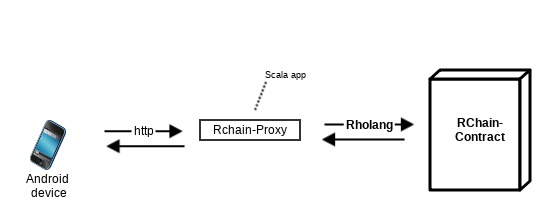

# Immersion to Rchain Contract Proxy

A REST layer to proxy Immersion mobile device requests to RChain contracts

## Getting Started

These instructions will get you a copy of the project up and running on your local machine for development and testing purposes. See deployment for notes on how to deploy the project on a live system

### Prerequisites

#### Installs

- [sbt](https://www.scala-sbt.org/)
- [JDK8](http://www.oracle.com/technetwork/pt/java/javase/downloads/jdk8-downloads-2133151.html?printOnly=1)

#### clone the repo

```
git clone git@github.com:kayvank/calculi.git
```

## Runig the tests

```
cd 
sbt test
```

## Deployment

### deploying [Docker](https://hub.docker.com/) image

TBD

## Built With

TBD

## References

- [Rholang](https://developer.rchain.coop/assets/rholang-spec-0.2.pdf)
- [RChain Cooperative](https://www.rchain.coop/)
- [http4s](https://github.com/http4s/http4s)


